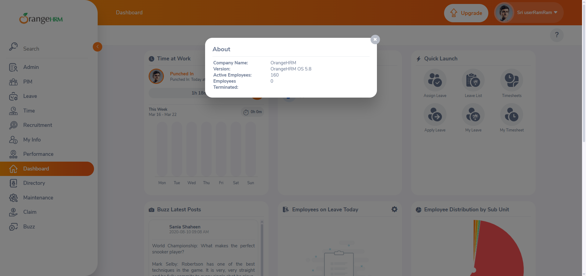

# OrangeHRM Automation using Selenium

## 🔹 Project Description
This project automates login and user menu actions in OrangeHRM using Selenium WebDriver.

## 🔹 Features
- Automated login functionality
- Explicit wait handling
- Dropdown interaction (Profile → About)
- Popup validation
- Screenshot capture

## 🔹 Tools Used
- Java
- Selenium WebDriver
- ChromeDriver

## 🔹 How to Run
1. Download project
2. Add Selenium dependencies
3. Run the Java file

## 🔹 Output
- Successfully logs into OrangeHRM
- Opens About popup
- Captures screenshot

## Screenshot

